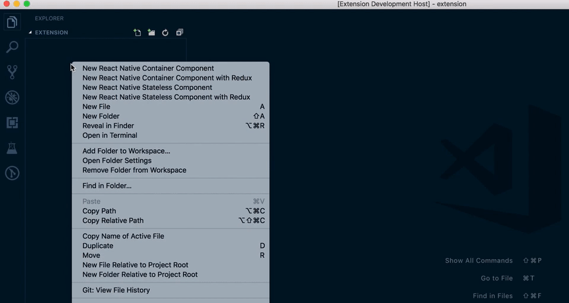
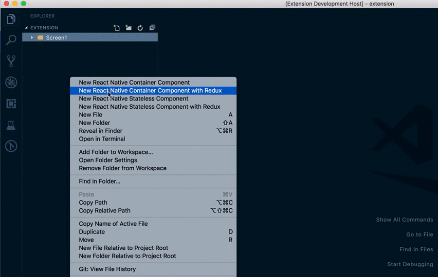
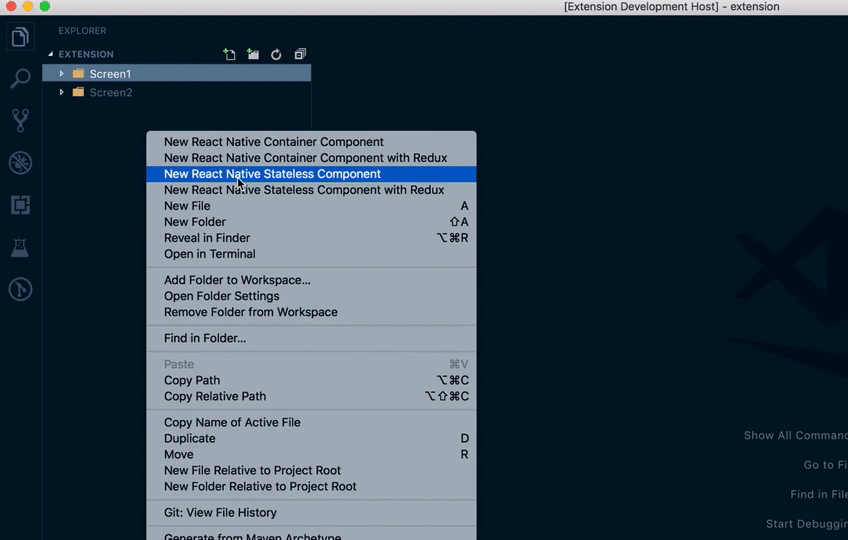

# React Native Component Generation Extension for VSCode

(**vscode-react-native-component-generator**)

[](https://marketplace.visualstudio.com/items?itemName=abdullahceylan.vscode-react-native-component-generator)
[](https://marketplace.visualstudio.com/items?itemName=abdullahceylan.vscode-react-native-component-generator)
[](http://opensource.org/licenses/MIT)
[](https://github.com/abdullahceylan/vscode-react-native-component-generator/releases)

## Description

The extension automatically creates folder for react native component containing :

- `index.js`
- `ComponentName.jsx`
- `ComponentName.styles.js`

## Installation

Install through VS Code extensions. Search for `VSCode React Native Component Generator`

[Visual Studio Code Market Place: VSCode React Native Component Generator](https://marketplace.visualstudio.com/items?itemName=abdullahceylan.vscode-react-native-component-generator)

Can also be installed in VS Code: Launch VS Code Quick Open (Ctrl+P), paste the following command, and press enter.

```bash
ext install abdullahceylan.vscode-react-native-component-generator
```

## Usage

- Right click on the file or folder in the file explorer
- Select one of following options:
  - "New React Native Container Component"
  - "New React Native Stateless Component"
  - "New React Native Container Component with Redux"
  - "New React Native Stateless Component with Redux"
- Enter a component name in the pop up in camelCase or PascalCase. If you enter the component name as in camelCase, then extension will convert it PascalCase automatically.








## Configuration

You can access to the extension's settings through VSCode settings. You can customize:

### `ACReactNativeComponentGenerator.global.generateFolder` (default: `true`)

Generate or not separate folder for newly created component

### `ACReactNativeComponentGenerator.global.quotes` (default: `single`)

Controls the quotes for the imports in the files. Valid options:

- "single" - e.g.: import React from `'`react`'`
- "double"  - e.g.: import React from `"`react`"`

### `ACReactNativeComponentGenerator.global.lifecycleType` (default: `legacy`)

The lifecycle type of generated component. Valid options:

- "legacy" - Contains `componentWillReceiveProps`, `componentWillMount`
- "reactv16"  - Contains `getSnapshotBeforeUpdate`, `getDerivedStateFromProps`, `getDerivedStateFromError`, `componentDidCatch` and removes `componentWillReceiveProps` and `componentWillMount`

### `ACReactNativeComponentGenerator.indexFile.create` (default: `true`)

Whether to generate component's index file or not.

### `ACReactNativeComponentGenerator.indexFile.extension` (default: `js`)

The extension of generated component index file. e.g.: index.(`extension`)

### `ACReactNativeComponentGenerator.mainFile.create` (default: `true`)

Whether to generate component's main file or not.

### `ACReactNativeComponentGenerator.mainFile.extension` (default: `jsx`)

The extension of generated component file. e.g.: ComponentName.(`extension`)

### `ACReactNativeComponentGenerator.styleFile.create` (default: `true`)

Whether to generate component's stylesheet file or not.

### `ACReactNativeComponentGenerator.styleFile.extension` (default: `js`)

The extension of generated stylesheet file. e.g.: ComponentName.styles.(`extension`)

### `ACReactNativeComponentGenerator.styleFile.suffix` (default: `.styles`)

The suffix to add to the end of the stylesheet filename. Default: ComponentName`.styles`.(extension)

### `ACReactNativeComponentGenerator.styleFile.type` (default: `styled-components`)

The type of stylesheet file to create. Valid options:

- "styled-components" - ComponentName.styles.`js`
- "standard" - ComponentName.styles.`js`

## Changelog

### [Click here](CHANGELOG.md)

## Bugs

Please report [here](https://github.com/abdullahceylan/vscode-react-native-component-generator/issues)
